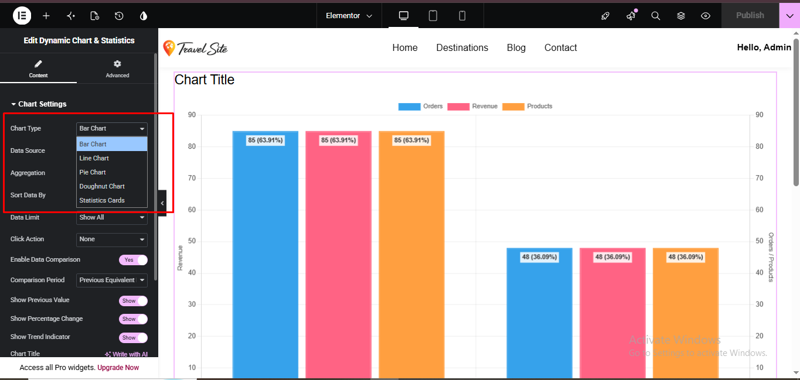
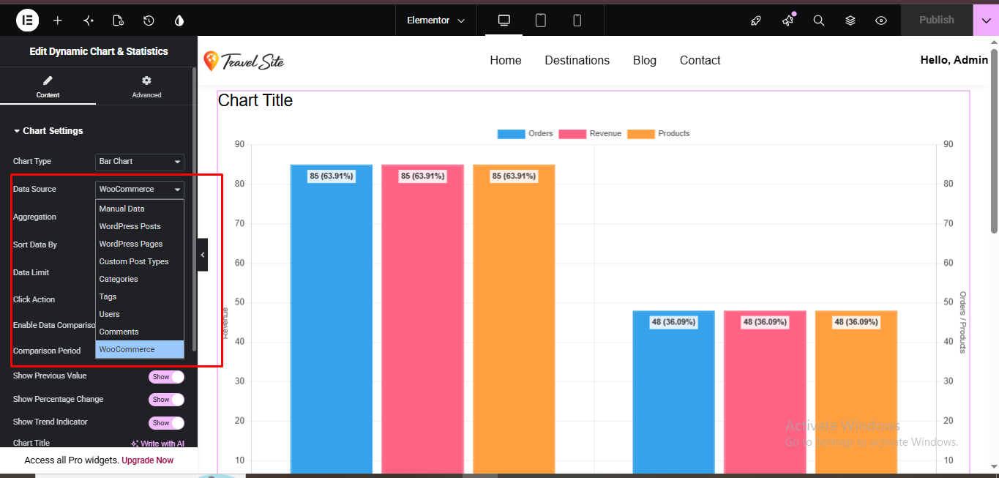
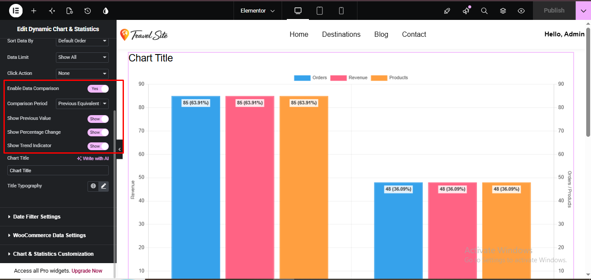
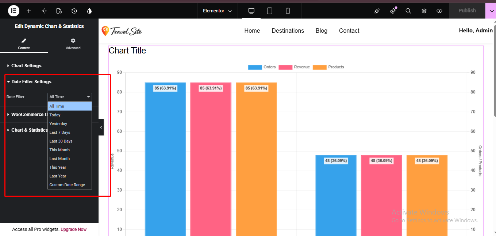
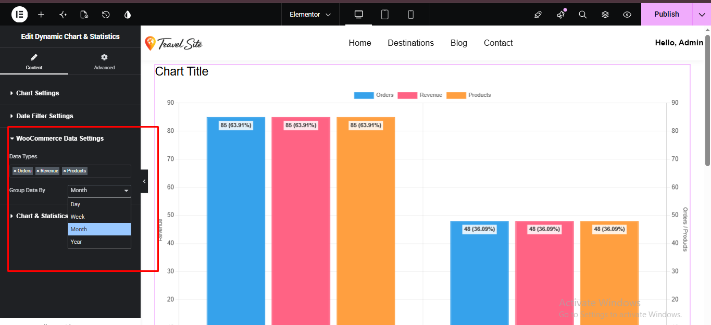
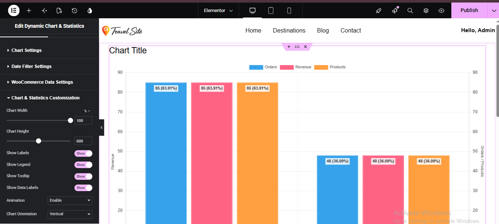

# Elementor Dynamic Chart & Statistics

A custom Elementor widget for displaying dynamic data through interactive charts and statistics. The widget supports multiple data sources, visualization types, data comparison, date filtering, grouping, sorting, and chart customization.

## 🚀 Key Features

- Bar Chart
- Line Chart
- Pie Chart
- Doughnut Chart
- Statistics Cards
- Manual Data
- WordPress Posts & Pages
- Custom Post Types
- Categories & Tags
- Users & Comments
- WooCommerce Data
- Data Aggregation
- Data Sorting
- Data Limits
- Data Comparison
- Previous Period Values
- Percentage Change
- Trend Indicators
- Date Filtering
- Day / Week / Month / Year Grouping
- Chart Customization
- Interactive Tooltips and Labels
- Responsive Chart Display
- Dynamic Data Handling
- Data Caching

## 🛠️ Technologies Used

- WordPress
- Elementor
- PHP
- JavaScript
- Chart.js
- HTML5
- CSS3
- WooCommerce
- AJAX

## 👩‍💻 My Role

- Developed the custom Elementor Dynamic Chart & Statistics widget
- Implemented multiple dynamic data sources
- Built chart rendering and visualization functionality
- Implemented data comparison and trend indicators
- Added date filtering and data grouping
- Integrated WooCommerce data
- Added chart customization controls
- Implemented dynamic data handling and caching
- Tested the widget with different data configurations

## 📸 Screenshots

### Chart Types

### Data Sources

### Data Comparison

### Date Filter Settings

### WooCommerce Data & Grouping

### Chart Customization

## 🔐 Source Code

The complete plugin source code is maintained privately.

This public repository is created for portfolio and project showcase purposes.
